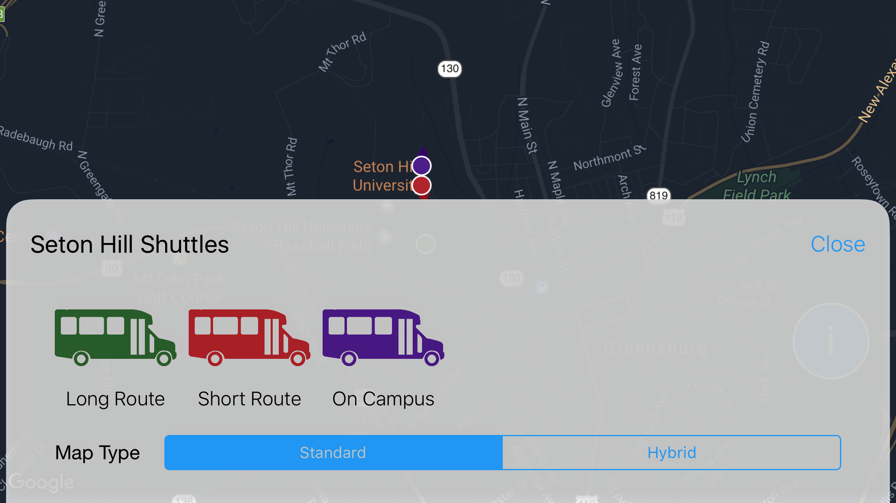
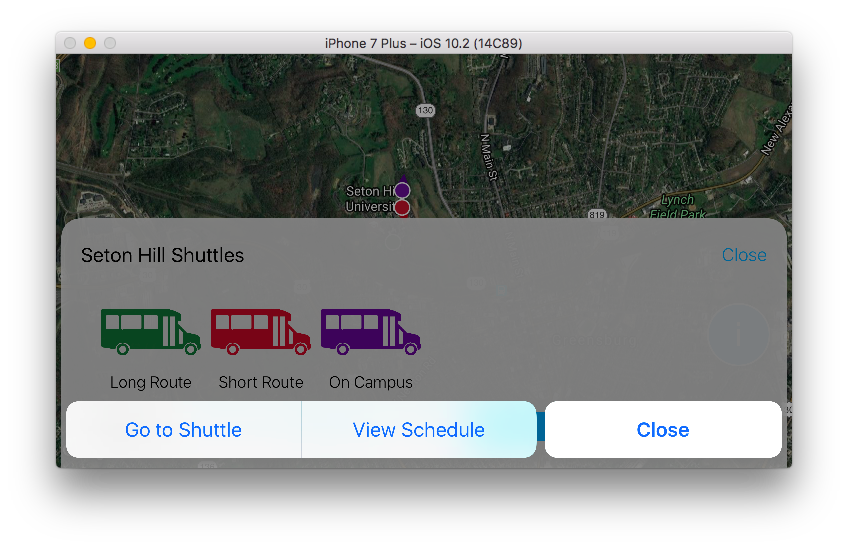

# Seton Hill University - Shuttle Tracker

Provide student and staff with a way to check a campus shuttles current location and schedule.

## Features
* Utilizes Firebase to push changes to all iOS devices with the app currently open. This occurs nearly instantly when data in Firebase is changed.
* Logs analytic data into Firebase.
* Logs crash data into Firebase.
* Manage parameters through Firebase Remote Config.
* Smooth interface that does not require the user to leave the main screen unless they are viewing schedule.
* Use the Google Maps iOS SDK because it is the most up to date map and has a great SDK.
* Flat design.

## Dependencies
* [Firebase](https://firebase.google.com/)
* [GoogleMaps](https://developers.google.com/maps/documentation/ios-sdk/)
* [Solar](https://github.com/ceeK/Solar)

## Status
Under Development - Currently testing in TestFlight
